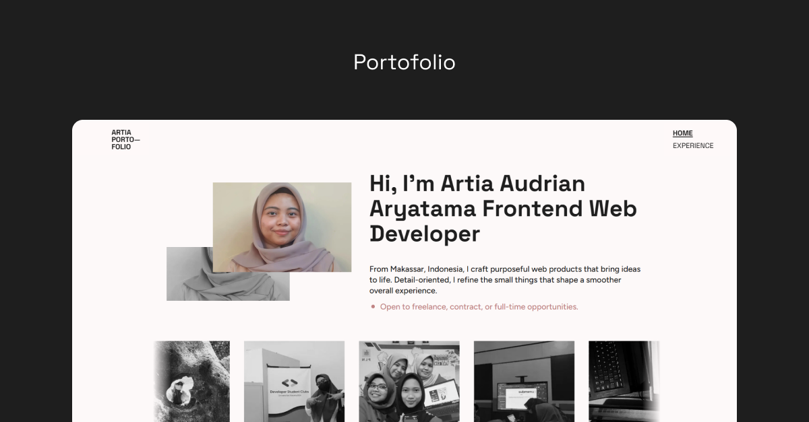

# 🌐 Personal Portfolio Website



A modern, responsive portfolio website built with Next.js, showcasing my projects, skills, and experience with smooth animations and clean design.

🔗 **Live Demo**: [https://artyaaryatama.me](https://artyaaryatama.me)

## 🚀 Quick Start

This is a personal portfolio website. If you'd like to run it locally for reference:

```bash
# Clone the repository
git clone https://github.com/artyaaryatama/artia-portofolio.git

# Navigate to project directory
cd artia-portofolio

# Install dependencies
npm install
# or
yarn install

# Run development server
npm run dev
# or
yarn dev
```

Open [http://localhost:3000](http://localhost:3000) in your browser.

## 📄 Copyright

© 2025 Artia Aryatama. All rights reserved.